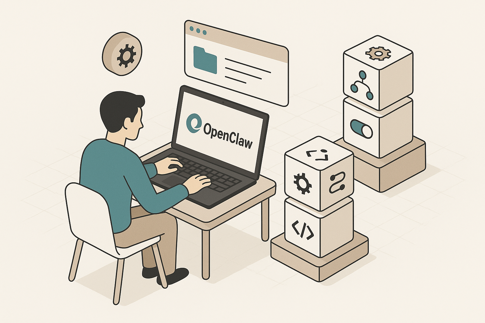
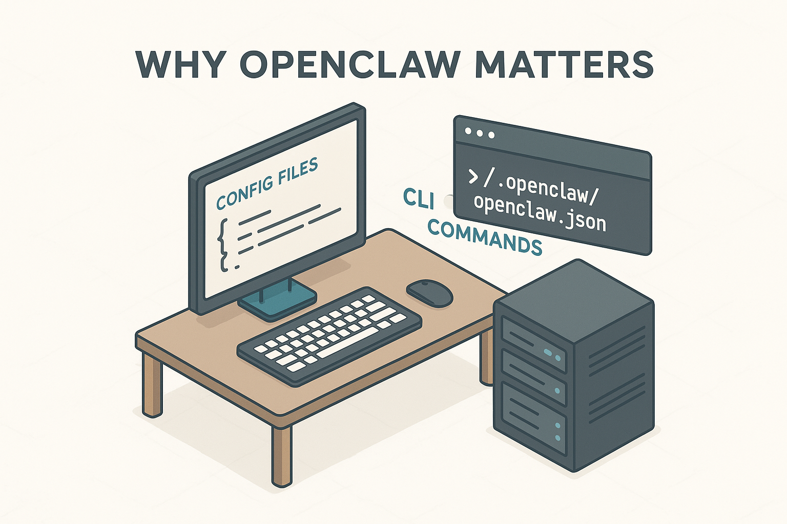
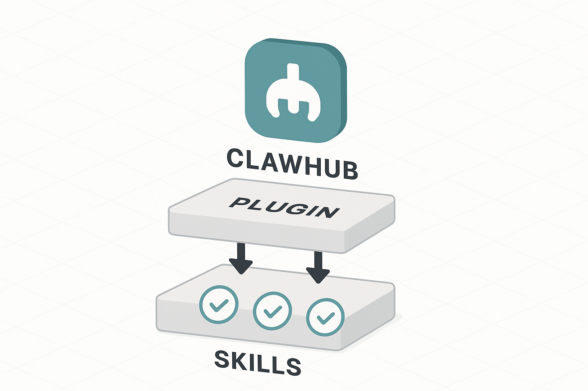
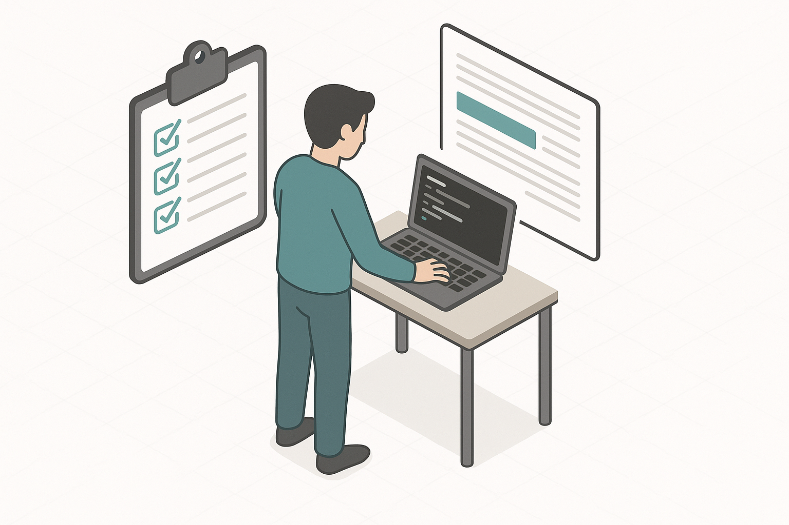

# OpenClaw 帶來的隨想

> 免责声明：本文为个人观点，不保证完全准确，旨在分享使用心得与实践中的经验教训。

## 引言

过去几年，AI 生态与 agent 平台快速演进。作为一名长期在本地部署 agent 与工具链上摸索的人，我希望把一些实践经验、遇到的问题（以及可行的对策）写成一篇面向工程师与技术决策者的短文。本文保持技术术语原文（例如 `skills`、`plugin`、`OpenClaw`、`ClawHub`、`cli` 等），并尽量保留代码片段与命令不变，以便读者直接复制使用。

## 为什么 OpenClaw 有价值

OpenClaw 的核心优势在于可组合性与本地化控制：你可以自由选择“brain”（模型）与“method”（skills），并把 agent 的输入输出、存储与工具链全部接入到你自己的 workspace。对于强调隐私、审计与长期可维护性的团队，这种可控性往往比完全托管方案更重要。

經驗上，一套好的本地 agent 平台應該包含：
- 明确的配置（例如 `~/.openclaw/openclaw.json`），便于复现与版本控制；
- 可插拔的 tools/skills 目录，方便使用 `clawhub` 安装或发布自定义扩展；
- 本地持久化的会话与向量索引，保证长期 memory 与检索能力；
- 清晰的 orchestration 层（Gateway/Orchestrator），处理渠道接入与消息路由。

这些要素结合起来，能把「实验性」的 agent 原型逐步演化为可投入生产的自动化组件。

## Skills、Plugins 与实操建议

在 OpenClaw 的生态里，`skills` 与 `plugin` 扮演不同但互补的角色：
- plugin 更偏向于系统级或 I/O 层的能力（比如 voice-call、channel bridge）；
- skills 偏向于上层的 agent 能力實現（如 GitHub 操作、摘要、爬虫等）。

實用建議：
1. 在开发初期，把核心能力封装成小而单一责任的 skill，便于组合与测试（单一职责原则）；
2. 使用 `clawhub` 管理共享技能：`clawhub publish` 与 `clawhub install` 能显著降低重复工作；
3. 对于关键凭证与 API key，严格限定文件权限（例如 `chmod 700 .openclaw/credentials/`）并使用环境化配置；
4. 在升级或运行修复（如 `openclaw doctor --fix`）前备份 `~/.openclaw/openclaw.json`，先做无破坏性检查再自动修复；
5. 把常用的 CI/CD、infrastructure（如 docker、helm、k8s）流程与 agent 工作流接入，推动 GitOps 化的自动化（用 `yaml`/`json` 做声明式配置）。

另外，community 的丰富度是一个重要考量。截至 2026 年社区规模迅速扩展，ClawHub 上有大量第三方 skills（部分高质量、活跃的项目能直接复用），这降低了从零开始构建能力的成本。

## 常见问题与应对策略

- 模型选择带来的不确定性：不同模型在推理风格、token 成本与能力上有明显差异。建议对关键任务做 A/B 测试，并把模型选择参数化（例如通过 `openclaw config get agents.defaults.models` 来管理）；
- 渠道与搜索行为差异：注意不同 messaging 渠道（Telegram、WhatsApp、Discord）在字符转码、回传格式、网络限制上的差异，测试每条渠道的边界条件；
- 升级风险：在大版本升级前，先在备份环境跑 smoke test，并把迁移步骤写成可重复的脚本（避免手工操作导致环境不一致）。

## 总结与下一步行动

OpenClaw 对个人与小团队而言，是一把把「模型」與「工具」連接起來的瑞士刀。要把它用好，需要工程化的思维：强配置、模块化、严格的凭证管理，以及把 agent 工作流纳入现有的 CI/CD 与 GitOps 流程。

实操上，我推荐的起手步骤是：
1. 在 sandbox 环境建立 `~/.openclaw/workspace` 并初始化 `SOUL.md`、`AGENTS.md`、`USER.md`；
2. 用 `clawhub` 安装 3–5 个关键 skill（search、github、firecrawl）并做小规模集成测试；
3. 编写一套备份与升级 playbook（包含 `openclaw doctor` 的非破坏性检查）；
4. 把常用运行命令写成脚本，纳入团队 wiki，降低新成员上手成本。

References:
- OpenClaw docs: https://docs.openclaw.ai/tools
- ClawHub: https://clawhub.ai/
