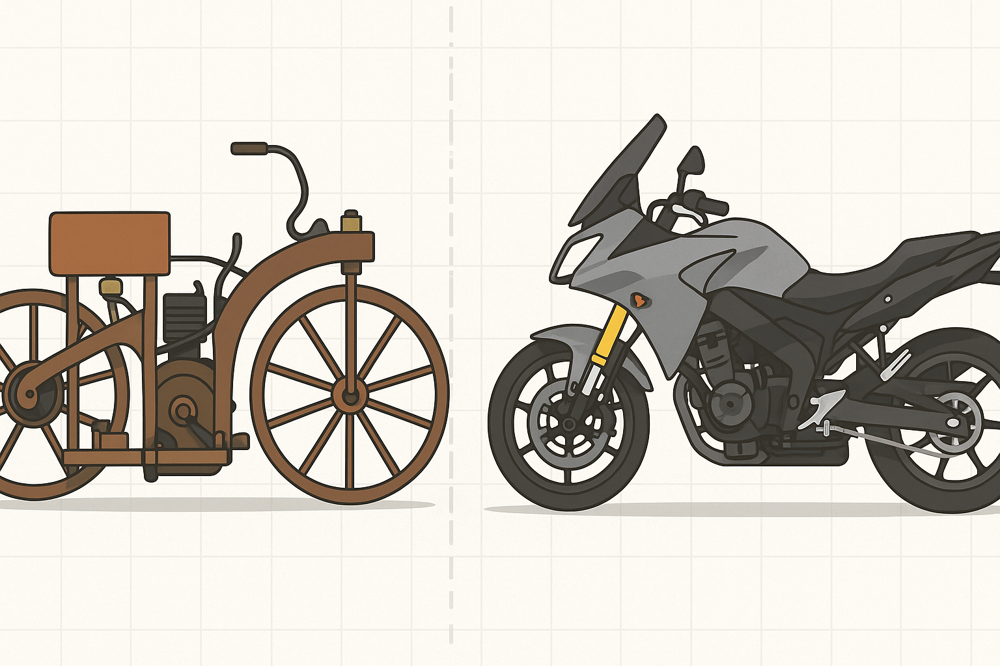
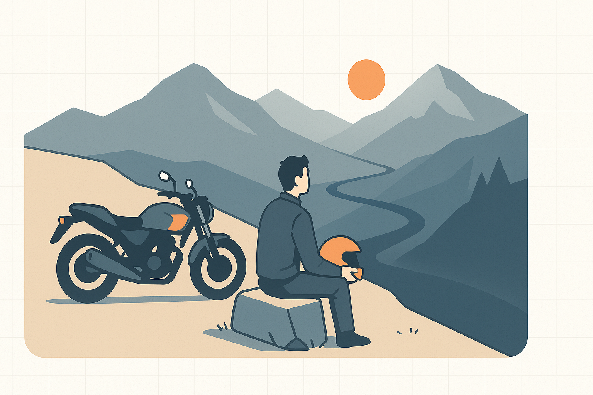

# 永恒的骑行魅力（改写与翻译）

摩托车从来不仅仅只是交通工具。它们象征着自由、精准，以及骑手、机器与道路之间那种亲密的联系。一个多世纪以来，摩托文化已从实用性的起点演变为深具表现力的生活方式，将工程智慧与热情、个性融为一体。

## 引言：为何骑行依然动人

摩托车既是移动的工具，也是感受世界的方式。与汽车不同，骑行要求你与机器同频，聆听、感受并回应每一次动力的起伏。这种直接性让骑行成为一种既外放又内省的体验：既有速度与刺激，也有专注与克制。

## 起源与演进：一段简短的历史

摩托车起源于19世纪末，当时发明家把小型内燃机装在自行车车架上。1885年，Gottlieb Daimler 与 Wilhelm Maybach 制作了通常被视为首辆摩托车的 Reitwagen（“骑行车”）。虽然结构粗糙，但它揭开了革命的序幕。

到20世纪初，Harley‑Davidson、Indian、Triumph 等品牌开始大量制造摩托车，为寻求实惠个人出行的用户提供了新的选择。两次世界大战后，归国士兵把骑行文化带回家，促成了早期骑友社群的发展。

1950s–60s 被视为摩托文化的重要年代：英国的 Norton、BSA、Triumph 激发了大众想象，而随后日本厂商（Honda、Yamaha、Suzuki、Kawasaki）以可靠性与性能重塑市场。技术继续推进：从80年代的多缸高性能发动机到21世纪的电子油喷、ABS、牵引力控制与线控油门，摩托车逐渐成为高科技但仍保留原始快感的机械艺术品。

## 车型与骑行风格：一面镜子，映出骑手

现代摩托种类繁多，每种车型都服务于特定的用途与骑乘感受。

- 长途旅行车（Touring）：以舒适为先，适合长途跋涉。代表如 Honda Gold Wing、BMW K1600。
- 探险/双用途（Adventure / ADV）：强调多地形适应性，既能上公路也能下越野，例如 BMW GS、KTM Adventure。
- 街头裸车（Streetfighter）：由跑车去掉整流罩改造而来，强调即时的动力与攻击性，如 Ducati Monster、Kawasaki Z 系列。
- 运动/赛道车（Sport/Racing）：以轻量化、高转速与空气动力学为导向，代表如 Yamaha YZF‑R1、Suzuki GSX‑R1000、Ducati Panigale。
- 巡航车（Cruiser）：低坐高扭、放松的几何姿态，适合慢速公路巡游，典型如 Harley‑Davidson、Indian。

不同车型反映出骑手的偏好：有人追求舒适与耐力，有人追求刺激与精准。很多人则介于两者之间，既欣赏街头裸车的锐利，也喜欢山路上的从容。

## 个人骑行篇：从 Ducati 到 Kawasaki 的体会

我的骑行旅程始于十年前，第一辆让我动心的是真正意义上的 Ducati Monster 821。近五年时间里，那台车教会了我关于摩托的一切：它不仅仅是代步工具，而是声、形、工艺的综合体验。

Ducati 821 在意大利工艺与城市能量之间达到了微妙平衡。L‑Twin 发动机的低频咆哮在扭油门时令人振奋；它奖赏精确，要求自信，也让你随时保持专注。市区骑行时，它教会我如何与车流共舞；上山时，它又能在弯道中表现出惊人的稳健。

五年后，我换到了 Kawasaki Z1000R，追求更多直接的力量，但不舍机动性。Z1000R 的直列四缸发动机带来线性的加速感与高转的顺滑，既适合山路拐弯，也适合夜间城市巡航。它的设计锋利且诚实：那种机械上的直率让你更倾向于“有意识地骑行”，而非莽撞。

如今我的骑行方式更趋成熟：城市与山路兼顾，注重能见度与预判，尊重极限但不逾越。骑行从最初的新鲜感演化为对技艺的追求——在倾角中感受掌控，在早晨的车流里保持冷静，这些瞬间带来的满足感愈发深刻。

## 结语：动力与控制之间的和谐

回首过去，摩托车在变，但它们的核心保持不变。Ducati 教会我敏感：去感受每一次抓地与动力的微妙变化；Kawasaki 则教会我自信和平衡。成熟的骑行并非单纯追求速度，而是理解动力与控制之间的和谐。

无论是在蜿蜒山路还是城市大街，骑行总会带来那些短暂而完美的时刻——当机器消失，只剩下行进本身。这便是我继续骑行的理由，也是摩托文化穿越世代仍能打动人的原因。

---

## 图像提示（按顺序：Hero + 每节）

1) Hero of motorcycle article: sweeping minimalist isometric scene of diverse motorcycles (touring, adventure, streetfighter, cruiser) lined along a coastal mountain road at golden hour, clean flat vector illustration, minimal isometric, white background with subtle grid, neutral palette with one warm accent, high-level detail, 16:9

2) 引言插图：骑手与机器的亲密特写，一位戴头盔的骑手把手微握，侧视构图，强调感觉与连接，clean flat vector illustration, minimal isometric, white background with subtle grid, neutral palette + one accent, 16:9

3) 起源与演进插图：历史对比图，左侧是 Reitwagen 的复古木制车架，右侧是现代带整流罩的运动与旅行摩托，平面分层构图，clean flat vector illustration, minimal isometric, white background with subtle grid, 16:9

4) 车型与骑行风格插图：四种车型并列图标式展示（Touring, Adventure, Streetfighter, Cruiser），每个小场景内有代表性的动作（长途装载、越野、弯道、放松巡航），consistent palette, clean flat vector, 16:9

5) 个人故事插图：城市夜间与山路对比分镜，一侧是夜间城市街道中骑行的身影，另一侧是山路弯道倾斜画面，表现成长与内省，clean flat vector, minimal isometric, 16:9
