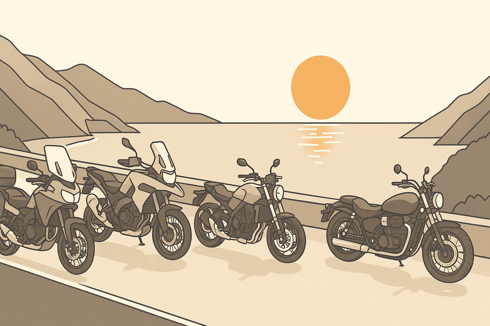
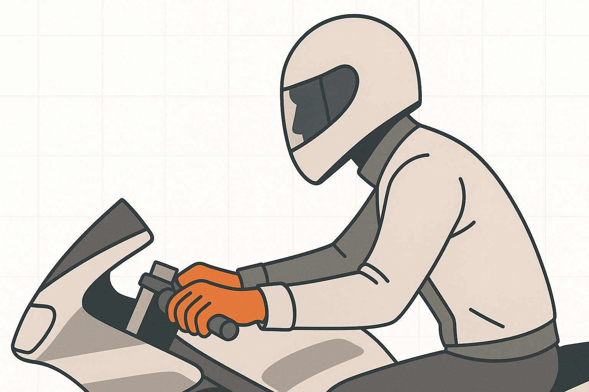
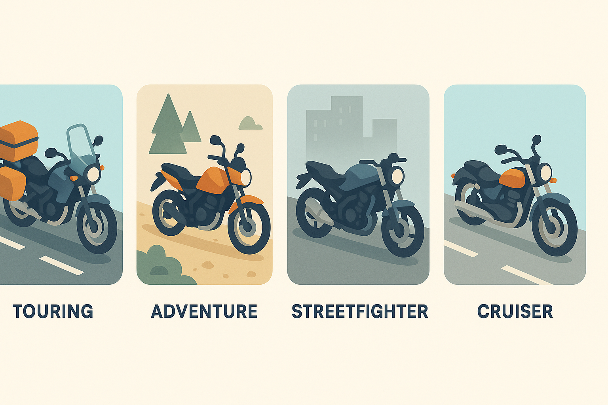
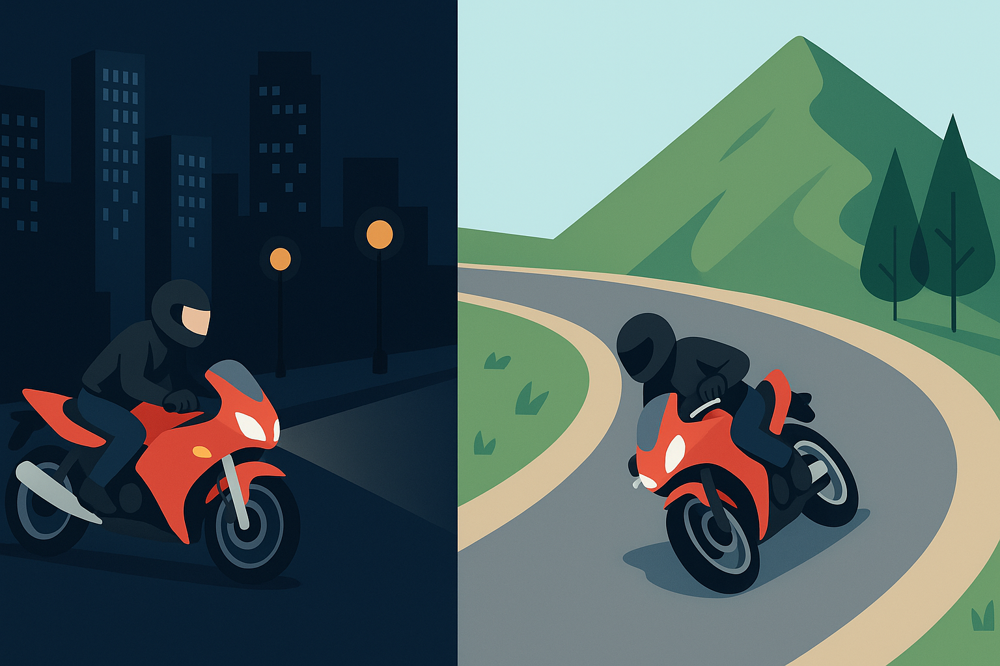

# The Timeless Allure of Motorcycle Riding

## Introduction

Motorcycles are more than machines; they are a way of being. For riders, a motorcycle is a precise instrument and a companion that translates intention into motion. Over the last century, motorcycles have evolved from simple, utilitarian transport into highly engineered platforms that simultaneously deliver performance, practicality, and personal expression. This article traces that evolution, surveys the major types of bikes today, and reflects on what motorcycling has taught me personally about skill, restraint, and the kind of freedom you only feel when two wheels are rolling beneath you.

## A Brief History of Motorcycles and Riding

The story of the motorcycle begins in the late 19th century, when bicycle builders experimented with mounting small engines on frames to gain speed and range. The 1885 Reitwagen by Gottlieb Daimler and Wilhelm Maybach is often cited as the first true motorcycle: a wooden-framed vehicle powered by a single-cylinder engine. Though primitive by modern standards, it proved an idea whose time had come.

Through the early 20th century, companies such as Harley-Davidson, Indian, and Triumph turned those early experiments into commercial machines. Motorcycles offered an affordable form of personal mobility long before cars were commonplace, and they found roles in both civilian life and military service. After the World Wars, returning soldiers who had ridden abroad helped seed the first modern riding communities, transforming motorcycles into cultural as well as mechanical artifacts.

The 1950s and 60s shaped motorcycling’s image: British marques like Norton and Triumph represented a mix of style and sporting ambition, while Japanese manufacturers—Honda, Yamaha, Suzuki, Kawasaki—eventually reoriented the market toward accessible reliability and scalable performance. From the 1980s onward, rapid technical progress—multi-cylinder engines, lighter frames, and advanced aerodynamics—paired with electronics like fuel injection, ABS, and traction control to make riding both faster and safer. These innovations preserved the visceral thrill of riding while lowering the barrier to entry for new riders and broadening motorcycling’s appeal.

## Varieties of Two-Wheeled Freedom

Modern motorcycles are tailored to different kinds of freedom. Their design choices—frame geometry, engine character, suspension travel—determine how a bike communicates with its rider.

- Touring: Built for distance and comfort, touring motorcycles prioritize wind protection, luggage capacity, and long-range ergonomics. Machines like the Honda Gold Wing and BMW K1600 are engineered to carry riders and gear for thousands of miles while minimizing fatigue.

- Adventure / Dual-Sport: Adventure bikes blend on-road manners with off-road capability. Models such as the BMW GS and KTM Adventure offer upright ergonomics, long travel suspension, and durable chassis designs that invite exploration across mixed terrain.

- Sport / Racing: Sportbikes are performance-focused tools. Light chassis, high-revving engines, and aerodynamic fairings create machines optimized for cornering precision and speed—examples include Yamaha’s YZF‑R1 and Ducati’s Panigale.

- Streetfighters and Naked Bikes: Emerging from the culture of customizing sportbikes, streetfighters strip away excess bodywork for a more raw, immediate feel. Their upright seating and exposed mechanicals emphasize character and urban agility.

- Cruisers: Cruisers prioritize low-slung ergonomics, torque-rich engines, and a relaxed riding posture. Think Harley-Davidson and Indian models that favor steady, contemplative cruising over lap times.

Each category offers a distinct recipe for what riding feels like. Some riders prize long-range comfort; others chase razor-sharp handling and acceleration. Many riders move fluidly between categories over their lives, bringing lessons from one style to another.

## My Riding Story: From Ducati to Kawasaki

I began riding about ten years ago. My initiation was a Ducati Monster 821—a bike whose personality felt like a compact piece of Italian design and engineering. The Monster rewarded precise inputs: its L‑twin engine provided a resonant, tactile soundtrack to every ride, requiring the rider to be deliberate with throttle and line. In the city, it taught me how to read traffic and maintain flow; on mountain roads, it taught me how to place the bike and trust its chassis through a sequence of corners.

After five formative years with the Ducati, I sought a machine with a different temperament: more immediate power and a different chassis balance. I moved to a Kawasaki Z1000R. The Z1000R’s inline‑four character delivers broad, smooth power and an aggressive aesthetic that invites fast, confident riding. Compared to the Ducati, it felt mechanically simpler but more direct—an engine that accelerates eagerly and a chassis that rewards committed inputs.

The arc of that transition mirrors how my riding matured. Early on, riding felt like an emotional rush and a study in sensation. Over time, it became a practice in measured control: anticipating hazards, managing energy through corners, and balancing the urge to push with the need to stay safe. I still enjoy spirited rides through mountain passes, but those moments are grounded by a philosophy of awareness—visibility, positioning, and respect for both machine and environment.

## Reflections on the Journey

Motorcycling remains timeless because it channels two enduring human impulses: the desire for mastery and the desire for freedom. Both bikes I’ve owned taught complementary lessons. The Ducati taught sensitivity—how small inputs change the bike’s behavior and how listening is as important as action. The Kawasaki taught confidence—how a well-built machine can amplify a rider’s intent without hiding the consequences of a mistake.

Ultimately, riding is less about speed than about harmony. The best moments happen when the bike ceases to be an object in front of you and becomes an extension of intent: a lean, a throttle roll, a brief and complete focus on line and balance. That is why motorcycling endures across generations and styles. Whether you ride a sportbike, a cruiser, or an adventure bike, each journey offers a singular clarity—a reminder that there is joy in motion and wisdom in restraint.

## Image Prompts (hero + per section)

- 2603230855-main.png — Hero image of motorcycle culture overview: a dynamic composition showing a rider on a motorcycle merging city and mountain landscapes, conveying freedom and precision, in clean flat vector illustration, minimal isometric, muted neutral palette with one accent color, simple icons/arrows showing motion and connection, soft directional lighting, no text, white background with subtle grid, 16:9

- 2603230855-section1.png — Introduction concept: rider and machine as a single instrument, hands on controls and subtle motion lines indicating intent and balance, clean flat vector illustration, minimal isometric, neutral palette + accent, calm directional lighting, no text, white background with subtle grid, 16:9

- 2603230855-section2.png — History timeline: a stylized, linear sequence of motorcycles from a wooden Reitwagen to vintage British bikes to modern sport and ADV machines, arranged left-to-right with simple labels/icons (no readable text), clean flat vector illustration, minimal isometric, consistent palette, high-level technical feel, white background with subtle grid, 16:9

- 2603230855-section3.png — Types-of-motorcycle diagram: grouped small scenes showing touring, adventure, sport, streetfighter, and cruiser silhouettes in contextual settings (highway, dirt trail, track, city, open road), clean flat vector illustration, minimal isometric, consistent neutral+accent palette, simple composition, white background with subtle grid, 16:9

- 2603230855-section4.png — Personal narrative: two side-by-side vignette panels—one showing a Ducati Monster in an urban corner, the other showing a Kawasaki Z1000R on a mountain road—conveying contrast in character and riding feel, clean flat vector illustration, minimal isometric, unified palette, no text, white background with subtle grid, 16:9

- 2603230855-section5.png — Reflection moment: a rider paused at a mountain overlook with helmet off, bike resting, horizon and winding road suggesting mastery and calm—simple, evocative composition, clean flat vector illustration, minimal isometric, subdued palette with a single accent color, white background with subtle grid, 16:9

## Summary

- Sections: 5
- Length: ~1,050 words
- Images: 1 hero + 5 section prompts

## References

This piece synthesizes common historical facts about motorcycle development and brand evolution. If you want specific citations added (for example, primary sources on the Reitwagen or brand histories), tell me which facts to footnote and I’ll add references.
