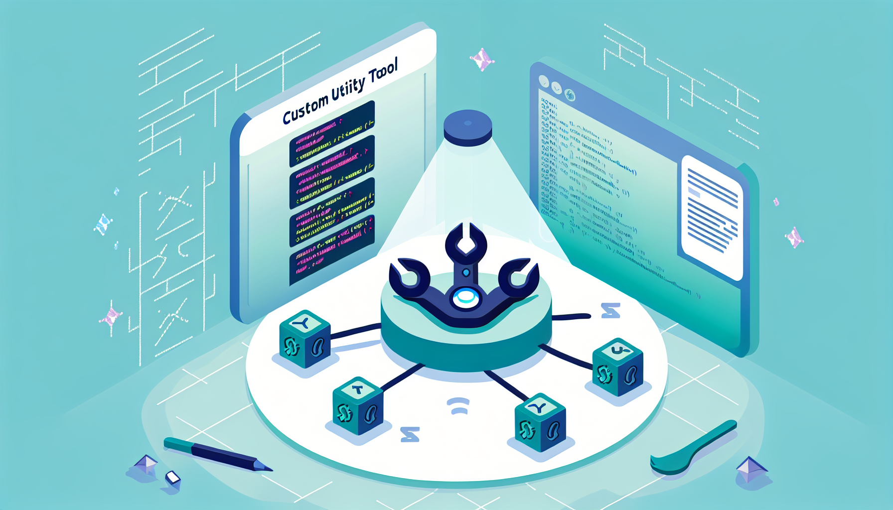

# Writing Your Own Custom Skill in OpenClaw 🦞



## Getting Started

I recently spent time helping a friend who manages several convenience stores figure out how to leverage AI to boost productivity. That conversation sparked an idea: what if I could build my own custom skills in OpenClaw instead of relying on pre-built ones? Turns out, it's totally doable.

This guide walks you through the entire process—from defining what you want to build, to writing a skill, testing it, and deploying it on ClawHub.

## Configure Your Models First

Before writing a skill, make sure your language and image models are properly configured. Most of the time, OpenClaw uses multi-modal models that handle both text and images. But if you want high-quality generated images, you should explicitly set an `imageGenerationModel`.

Start by listing your current models:

```sh
openclaw models list
```

You should see something like this:

```sh
🦞 OpenClaw 2026.4.5 (3e72c03)
   Your task has been queued; your dignity has been deprecated.

Model                                      Input      Ctx      Local Auth  Tags
anthropic/claude-haiku-4-5-20251001        text+image 195k     no    yes   default,configured
openai/gpt-5.1-codex                       text+image 391k     no    yes   configured,alias:GPT
openai/gpt-5-mini                          text+image 391k     no    yes   configured
google/gemini-3-flash-preview              text       195k     no    yes   configured,alias:gemini-flash
moonshot/kimi-k2.5                         text+image 250k     no    yes   configured,alias:Kimi
```

In my case, `openai/gpt-image-1` is defined as `agents.defaults.imageGenerationModel`. Store your API keys in `~/.openclaw/.env` — treat this file like your credit card and keep it secure.

```json
openclaw config get agents.defaults.imageGenerationModel

🦞 OpenClaw 2026.4.5 (3e72c03)
   I don't sleep, I just enter low-power mode and dream of clean diffs.

{
  "primary": "openai/gpt-image-1",
  "fallbacks": [
    "google/gemini-3-pro-image-preview",
    "fal/fal-ai/flux/dev"
  ]
}
```

## Think Before You Build

The most important step comes before you write any code. Sit down and write out exactly what you want your skill to do, all in one markdown document.

Let's say you want to build a skill that polishes a technical blog post. You might document it like this:

- **Input:** A raw markdown draft about a technical topic (e.g., Linux file sync workflows)
- **Processing:** Rewrite the draft into 1,000–1,200 words of polished en-US English, across 4–5 logical sections
- **Preservation:** Keep all technical terms, code blocks, file paths, and command examples exactly as they are
- **Output:** A cleaned-up markdown file and one hero image that visually summarizes the entire article
- **Styling:** Use consistent visual language (e.g., "clean flat vector illustration, minimal isometric")
- **Resolution:** Generate the image at 16:9 aspect ratio, suitable for a blog header

Once you have that written out and analyzed by any AI tool (I personally prefer to use Perplexity), you've got a blueprint.

## Create Your SKILL.md

Now it's time to write the actual skill definition. This is where you define inputs, outputs, and the workflow.

A typical SKILL.md has two parts: YAML frontmatter and markdown documentation. Here's a real example:

```yaml
---
name: blog-polish-eng-single-image
description: Polish a technical blog draft into a 1000–1200 word, 4–5 section en-US article, preserve technical terms/code, and generate one consistent hero image prompt.
author: Jeff Yang
version: 1.0.5
tags: [openclaw, clawhub, blog, polish, translate, markdown, images, prompts]
triggers: ["polish blog", "technical blog images", "blog draft images"]
metadata:
  openclaw:
    requires: []
    platforms: ["linux", "darwin"]
    env: []
inputSchema:
  type: object
  properties:
    draftPath:
      type: string
      description: Path to the draft markdown. Defaults to ~/.openclaw/workspace/contentDraft/latestDraft.md
    outputDir:
      type: string
      description: Directory to save outputs. Defaults to ~/.openclaw/workspace/contentPolished/
    subject:
      type: string
      description: Short subject slug used in output filename (e.g. openclaw-skills). If omitted, infer from the draft title.
    style:
      type: string
      description: Visual style phrase reused for the hero image (e.g. "clean flat vector illustration, minimal isometric").
    background:
      type: string
      description: Background phrase reused for the hero image (e.g. "white background with subtle grid").
    aspectRatioHero:
      type: string
      description: Aspect ratio for hero image (e.g. "16:9 horizontal").
  required: []
outputSchema:
  type: object
  properties:
    polishedPath:
      type: string
      description: Path to the final polished markdown file.
    imagePath:
      type: string
      description: Path of the generated hero image, or intended filename if only a prompt was produced.
    imagePrompt:
      type: string
      description: Single-line prompt for the hero image.
---

# Blog Polish Skill

This skill rewrites a technical blog draft into a polished English article and generates exactly one hero image as a PNG, using one matching hero prompt. It is intended for drafts that already contain technical content, code, commands, or product details that should be preserved while improving clarity, structure, and reading flow.

## Purpose

Use this skill when you want to turn a rough technical draft into a publishable article without losing domain-specific detail. The output should read naturally in en-US English, stay faithful to the original meaning, and keep technical terms, identifiers, code blocks, file paths, and command examples intact unless a correction is clearly needed.

This skill generates one hero image only. It does not create per-section images. The single hero image should summarize the whole article visually at a high level and should be consistent with the article’s subject and tone.

## When to use

Use this skill when the source draft is one of the following:

- A technical blog post that needs editing for clarity and flow.
- A translated draft that should be rewritten into natural en-US English.
- A markdown article that needs a better structure and cleaner sectioning.
- A post that should include one matching hero image prompt for later image generation.

Do not use this skill for short notes, changelogs, marketing copy, or posts that do not need technical preservation.

## Editing behavior

The rewrite should preserve the author’s intent while improving readability. Prefer shorter paragraphs, clearer transitions, and section headings that guide the reader through the main idea.

Rewrite the article in spoken, unofficial English that feels natural, clear, and conversational, while still preserving technical accuracy.

The skill should:

- Keep technical terms, product names, API names, file names, and command syntax accurate.
- Preserve code blocks, inline code, quoted commands, and URLs unless they are obviously wrong.
- Improve grammar, sentence flow, and article structure.
- Expand thin or fragmented notes into a coherent article when the source material supports it.
- Avoid inventing facts, results, benchmarks, or claims that are not present in the draft.

The skill should not:

- Rewrite code into prose.
- Remove essential technical details.
- Add unnecessary marketing language.
- Split the article into section images or multiple image prompts.

## Input fields

`draftPath` points to the source markdown draft. If omitted, the skill reads the default latest draft file from the workspace. This should contain the original article text, headings, and any code samples that need preservation.

`outputDir` sets where the polished markdown file and image filename should be saved. If omitted, the skill uses the default polished-content directory.

`subject` is used to build the output filename. If not provided, the skill should infer a short slug from the article title.

`style` defines the visual language for the hero image. Use one style phrase consistently so the image matches the article’s mood.

`background` defines the backdrop for the hero image. Keep it simple and reusable across posts for consistency.

`aspectRatioHero` controls the hero image shape. Typical values are `16:9 horizontal` or similar wide formats suitable for blog headers.

## Output

The skill produces one polished markdown file and one hero image prompt.

The polished file should contain:

- A cleaned-up title.
- A strong introduction.
- 3 to 5 content sections, depending on the source material.
- A concise closing section if appropriate.
- Preserved technical content where relevant.

The image output should contain:

- The image file must be written in the same directory as the markdown file and must use the same basename with a .png extension.
- One hero image filename or intended image path.
- One single-line hero prompt.
- A high-level visual summary of the article, not a section-by-section breakdown.

## Image policy

This skill intentionally generates one image only.

The image should be:

- A hero image for the whole article.
- Visually aligned with the topic and style.
- Broad enough to represent the subject without depending on individual section contents.
- Consistent with the same visual style and background settings used across posts.

The image should not be:

- A separate illustration for each section.
- A collage of unrelated concepts.
- Overly literal if the topic is abstract.
- Packed with too many technical labels or small details.

## Workflow

1. Resolve the draft and output paths.
2. Read the markdown draft.
3. Extract the title and basic structure.
4. Rewrite the article into polished en-US prose.
5. Save the polished markdown file.
6. Create one hero image prompt only.
7. Return the final file path, hero image path, and image prompt.

## Constraints

Maintain the meaning of the original draft. If the source contains code snippets, commands, paths, or configuration examples, keep them intact and formatted correctly. If the draft is sparse, improve clarity and organization, but do not fabricate missing technical content.

Keep the article focused and practical. Prefer specific explanations over generic filler. If the article has a narrow technical subject, the hero image should stay broad and conceptual rather than trying to depict every detail.

## Example usage

A draft about a Linux file synchronization workflow might be polished into a clear article with headings such as introduction, setup, common pitfalls, and conclusion. The hero image prompt could describe a clean technical illustration showing a laptop, file paths, and subtle sync arrows, but only as one overall image for the post.

## Implementation notes

The workflow should emit a single structured output object with these fields:

- `polishedPath`
- `imagePath`
- `imagePrompt`

The image must be written as a PNG file. It must use the same basename as the markdown file and be saved in the same directory as the markdown file. The skill should not emit arrays of images or prompts. It should not reference per-section image generation in the description, schema, or workflow.

Generate the image using OpenClaw’s default image model (`agents.defaults.imageModel`) unless an explicit image generation model is provided by the environment.
```

The structure is straightforward: name, description, version, input parameters, and output structure. Keep it clear and specific about what your skill does.

The complete SKILL.md can be found at https://clawhub.ai/j3ffyang/blog-polish-eng-single-image

## Validate and Iterate

Before you publish, use an AI tool like Perplexity or Claude to review your SKILL.md against the OpenClaw and ClawHub standards. Give it this prompt:

```
Review this SKILL.md for compliance with OpenClaw and ClawHub standards.
Check the JSON schema, descriptions, and workflow logic.
Suggest any improvements to clarity or structure.
```

Iterate a few times until you're confident the skill is solid. Small mistakes in the schema now save debugging time later.

## Install and Test Locally

Once you're happy with your SKILL.md, install it locally:

```sh
cd ~/.openclaw/workspace/skills
clawhub install your-skill-name
```

List installed skills to confirm:

```sh
clawhub list
```

You should see your skill in the output. Now test it from your configured channel (Discord, WhatsApp, Telegram, etc.):

```
trigger "your-skill-name"
```

Watch the output in your workspace folder and check that the polished markdown and generated images appear where you expected them.

## Deploy to ClawHub

When you're confident your skill works, upload it to ClawHub:

```sh
clawhub publish ~/.openclaw/workspace/skills/your-skill-name
```

ClawHub will validate the SKILL.md and make it available to the community. Don't worry if it flags shell scripts as "suspicious"—it's just a warning. As long as you trust your own code, you're fine.

Once published, anyone can install your skill with:

```sh
clawhub install your-username/your-skill-name
```

## Final Notes

Building custom skills in OpenClaw is straightforward once you understand the workflow: think clearly about your goal, write a solid SKILL.md that matches the standards, validate it, test locally, and publish when you're ready. The whole process, from idea to community-shared tool, typically takes less than an hour.

Your skills become part of your productivity toolkit—and if they're good, they become part of the community's toolkit too.

---

tag: #openclaw #ai #opensource #linux #clawhub #skill
